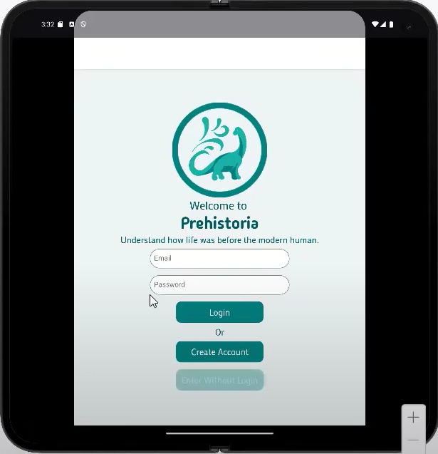

  My project design is based on the idea of creating a learning app that teaches you about the prehistoric era. I had the idea of it being a situation where you are entering a museum, and there are specific exhibits that are available for you to look at and interact with.
    
  The main exhibit is to do with dinosaurs and this is what you are being tested on with topic quizzes that help you type/categorize specific dinosaurs.
    
  

    
  

  For the second exhibit, I implemented the accelerometer as a small interactive game, where you need to clean up a fossil until the picture is revealed. You can achieve this by rotating the screen forwards and backwards until the percentage goes up to 100.
    
  For the third exhibit, I wanted to use location services to provide specific information about the area that the user lives in from the prehistoric era. I also added in a small exhibit about the evolution of the human species.
    
  Here is the video playthrough:
    
  

