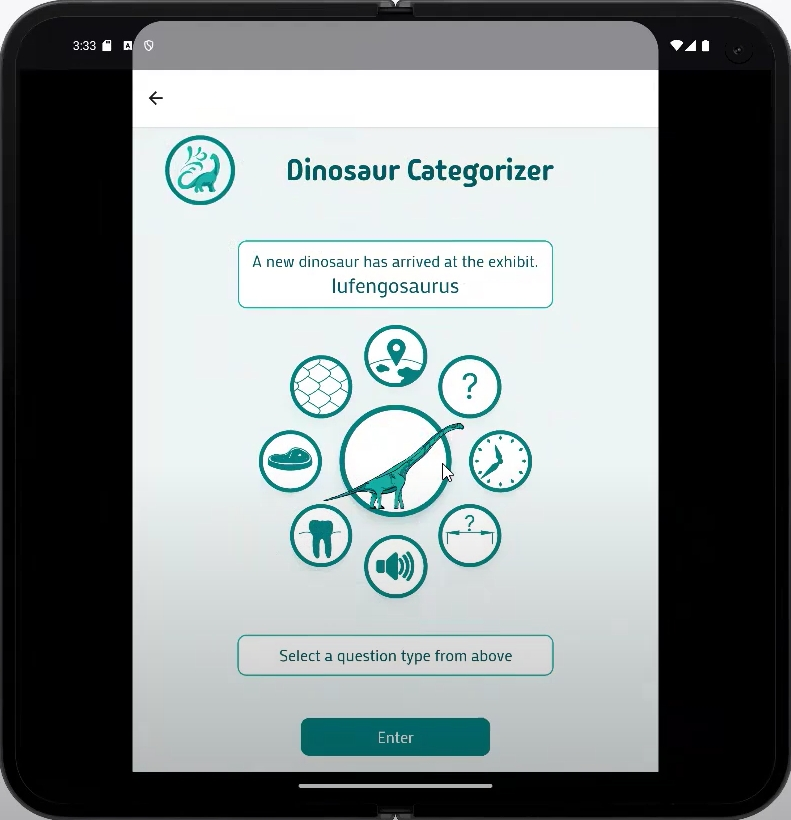
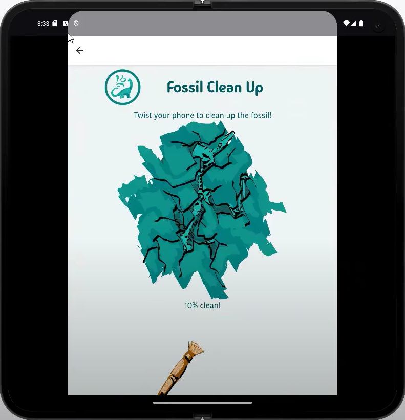

<h1 align="left">
  Summary
</h1>

  My project design is based on the idea of creating a learning app that teaches you about the prehistoric era. I had the idea of it being a situation where you are entering a museum, and there are specific exhibits that are available for you to look at and interact with.

<h1 align="left">
Video playthrough
</h1>

  Click for video below:

<h1 align="left">
  Breakdown
</h1>
<h2 align="left">
  Entry Point
</h2>

    
  

    
    
    
  

  To start, the user can either play without logging in, but their achievements and collections won't be save, or they can log in which uses a firebase backend to save thier achievements etc.
  The user is then taken to a menu screen where they tap on the different parts of the museum to enter different areas of the app.

  
<h2 align="left">
  Main exhibit - Dinosaur Categorizer
</h2>

  The main exhibit is to do with dinosaurs and this is what you are being tested on with topic quizzes that help you type/categorize specific dinosaurs.

<h3 align="left">
  Quiz element - The Dinosaur Dashboard and Question Screen 
</h3>

  
  

  
  

  Question screen - For this I wanted to generate random wrong question choices based on the dataset for each type of question when the question screen is navigated to, which are placed randomly so that the correct choice is in a random position each time.
  If the answer is correct it then passes that the category is complete back to the ‘DinosaurDashboard’, if incorrect it just returns to the dashboard so the user can try again.
  
  Dinosaur Dashboard - This mainly dealt with the responses from the question screen situations, but also navigated to the dinosaur summary.
  When a question type was given the flag from the question screen that it was completed, it updated the data that was in the CategoriesProvider in the components section, which would then go back to the dinosaurDashboard screen and update the icons and usestates. When all categories were complete it would then pass the data to firebase for that specific dinosaur on press of the submit button.
  
  The graphics of this screen utilized geometric principles in order to make the type buttons circular around the main dinosaur button.
  
  The most difficult part of these particular screens was that I needed to retain the information about if a specific question is complete, and update the images if they were complete. I used “createContext“ from react in order to achieve this which can be seen in ‘CategoriesProvider’ so that the information would persist following navigation between the two screens.

<h3 align="left">
  Google Gemini API implementation
</h3>

  

  For the implementation of an API I chose google gemini. I Implemented in the Utils folder the required code to implement gemini, and then used: import { getGeminiResponse } from "../utils/gemini";
   To import it. 
  The useEffect inside DinoSummary awaits the response of the question asked (which is created with information from the random dinosaur that was assigned at the navigation to dino dashboard, and then the format is altered to remove any unnecessary items from the gemini response, i.e. ‘*’’s.
  The response is then recorded in the useState to be added to the screen view.

  
  

<h3 align="left">
  Firebase/Firestore Implementation, and utilizing it in Dinosaur ‘Collections’ screen and ‘Progress Tracker’ screen
</h3>

  Login authentication - This is using the firestore authentication system and signInWithEmailAndPassword to login the user in, and is located at the entry screen, and has errors pop up if the user tries to log in with an incorrect account
  
  Creating an account - This also creates an account using firestore. There is a handleSignUp which deals with if a user uses characters incorrect to create an account, or if the account is correct it sends back a message
  
  DinoDashboard - Once all questions for the specific dinosaur have been answered the data for that specific dinosaur is passed to firebase in two items, dinosaurTypeCount and identifiedDinosaurs.
  For instance:
  "dinosaurTypeCount": {"euornithopod": 1, "small theropod": 1}, 
  "identifiedDinosaurs": {"hadrosaurus": "euornithopod", "velociraptor": "small theropod"}
  These aid in creating the Collections and Progress Tracker screens.
  
  Progress Tracker - Uses dinosaurTypeCount in firebase to count how many in total of each dinosaur type has been collected. This also utilizes the table/cell views we learnt in the lectures.
  
  Collections - Uses identifiedDinosaurs in the firebase to count how many unique dinosaurs there are that have been collected of each type.

<h2 align="left">
  Second exhibit - Fossil Clean-up
</h2>

  For the second exhibit, I implemented the accelerometer as a small interactive game, where you need to clean up a fossil until the picture is revealed. You can achieve this by rotating the screen forwards and backwards until the percentage goes up to 100.

  

  Following the topic in the mobile development lectures, I wanted to expand on the idea of the accelerometer to create a small game within the app. When the y value reaches a certain point when the screen is tilted in the plus and minus direction, a value is incremented as a useState. When this particular value gets to a certain point, the image changes so it looks like you are gradually cleaning up a fossil.

<h2 align="left">
  Third exhibit - Human Evolution
</h2>

  For the third exhibit, I wanted to use location services to provide specific information about the area that the user lives in from the prehistoric era. I also added in a small exhibit about the evolution of the human species.

  
  
  

  Following the topic in the mobile development lectures, I wanted to add a small feature to the app which was to use the location services to find out the specific continent the user is from. There is a dataset that is in the data folder that is referred to to convert country codes to their respective continent, and then the continent is mapped to a small const: ‘continentToYear’ . This then updates a useState to let the user know at what point the modern human arrived at their continent.

  For the human evolution exhibit, I implemented data from a dataset to create sliders which showed some information about the different stages of human evolution.

